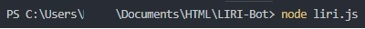
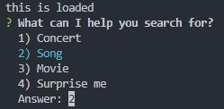
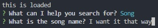
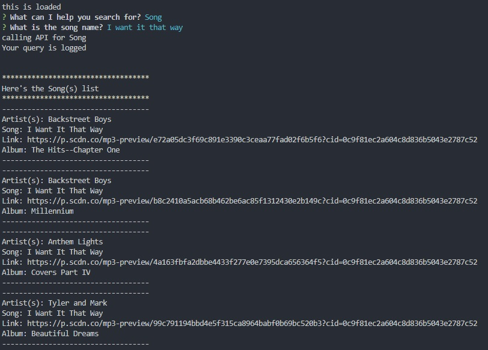

# LIRI Bot
LIRI is like iPhone's SIRI. However, while SIRI is a Speech Interpretation and Recognition Interface, LIRI is a _Language_ Interpretation and Recognition Interface. LIRI will be a command line node app that takes in parameters and gives you back data.

LIRI will search Bands in Town for concerts, Spotify for songs, and OMDB for movies.

### Node Packages
[DotEnv](https://www.npmjs.com/package/dotenv),
[Moment](https://www.npmjs.com/package/moment),
[Inquirer](https://www.npmjs.com/package/inquirer),
[Axios](https://www.npmjs.com/package/axios), and
[Node-Spotify-API](https://www.npmjs.com/package/node-spotify-api)

### APIs (You'll need your own keys/ids/secrets to execute this awesome program)
[Bands In Town API](http://www.artists.bandsintown.com/bandsintown-api),
[Spotify](https://developer.spotify.com/documentation/web-api), and
[OMDB](https://www.omdbapi.com)

### Instructions
1. Clone this repo on your drive.
2. cd to this dir using your favorite terminal (e.g. [git bash](https://gitforwindows.org/)).
3. Open the project dir in your fav JS/Node code editor (e.g. [Visual Studio Code](https://code.visualstudio.com/)) and EDIT `.env` file in it.
   * ADD the following ids/secrets/keys in this file.
   ```
   SPOTIFY_ID=<your_spotify_id>
   SPOTIFY_SECRET=<your_spotify_secret>
   OMDB_KEY=<your_omdb_key>
   BANDSINTOWN_KEY=<your_bandsintown_key>
   ```
4. Run the program using the below cmd.
```
npm start
```
5. Follow the simple instructions on your screen and have fun!

   
   
   
   
   
   
   
